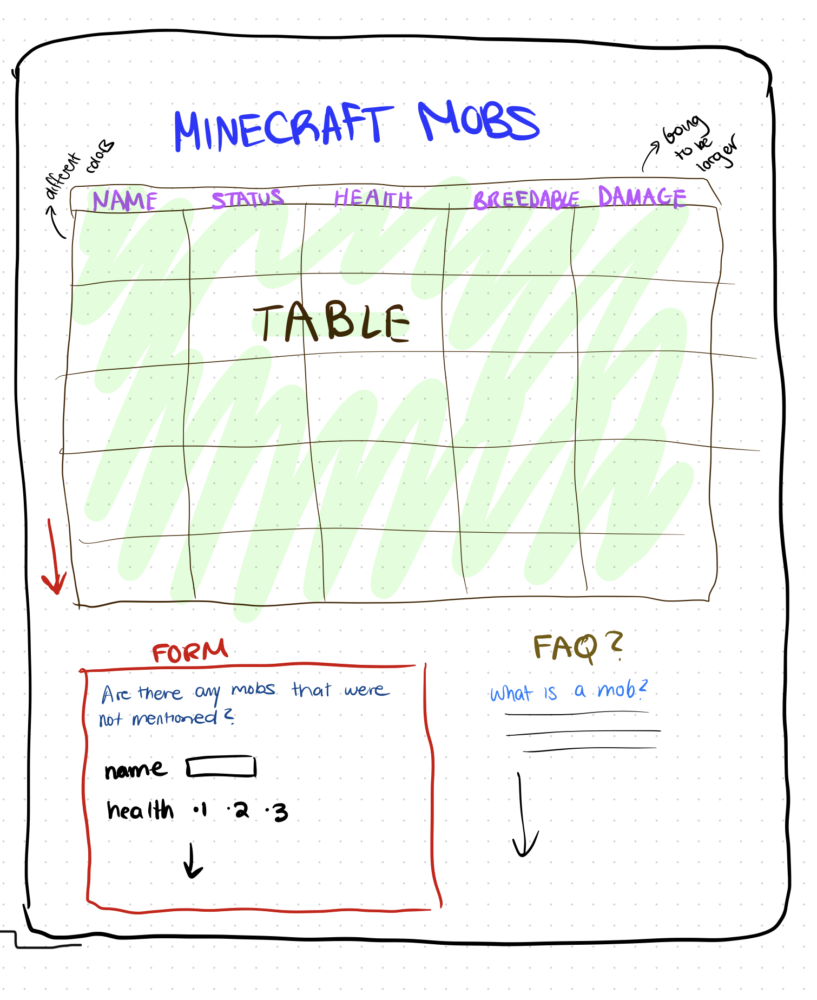

# Project 2: Design Journey

**For each milestone, complete only the sections that are labeled with that milestone.** Refine all sections before the final submission.

You are graded on your design process. If you later need to update your plan, **do not delete the original plan, rather leave it in place and append your new plan _below_ the original.** Then explain why you are changing your plan. Any time you update your plan, you're documenting your design process!

**Replace ALL _TODOs_ with your work.** (There should be no TODOs in the final submission.)

Be clear and concise in your writing. Bullets points are encouraged.

**Everything, including images, must be visible in _Markdown: Open Preview_.** If it's not visible in the Markdown preview, then we can't grade it. We also can't give you partial credit either. **Please make sure your design journey should is easy to read for the grader;** in Markdown preview the question _and_ answer should have a blank line between them.


## Design Plan (Milestone 1)

**Make the case for your decisions using concepts from class, as well as other design principles, theories, examples, and cases from outside of class (includes the design prerequisite for this course).**

You can use bullet points and lists, or full paragraphs, or a combo, whichever is appropriate. The writing should be solid draft quality.


### Catalog (Milestone 1)
> What will your catalog website be about? (1 sentence)

It will be like a dictionary or wikipedia for Minecraft characters, similar to the example provided with Pokemon; "PokeDex".


### Audience (Milestone 1)
> Briefly explain your site's audience. Your audience should be specific, but not arbitrarily specific. (1 sentence)
> Justify why this audience is a **cohesive** group. (1-2 sentences)

My audience consists of people who are interested in the background in each character in the game. Gamers who play the videogame.

This is a cohesive audience since these gamers would all have the same goal; wanting to know more about an enemy or passive mob in the game, to improve their overall experience playing.


### Audience Goals (Milestone 1)
> Document your audience's goals for using this catalog website.
> List each goal below. There is no specific number of goals required for this, but you need enough to do the job (Hint: It's more than 1. But probably not more than 3.)
> **Hint:** Users will be able to view all entries in the catalog and insert new entries into the catalog. The audience's goals should probably relate to these activities.

Goal 1: Learn more about the game

- **Design Ideas and Choices** _How will you meet those goals in your design?_
  - I would make sure the design is organized and easy to look at. Meaning everything will be aligned (which is a usually a weakness for me) and the website theme will be matched with the auidence's needs. I would also make sure to include necessary fields that may be important to learn more about the game.
- **Rationale & Additional Notes** _Justify your decisions; additional notes._
  - Having a neat layout for a lot of information on one page would need to be considered since delivering information to the user should be the first thing to worry about.

Goal 2: Provide more information for others

- **Design Ideas and Choices** _How will you meet those goals in your design?_
  - This would be met through a form on the page, asking for any information the user may think the website needs for improvement.
- **Rationale & Additional Notes** _Justify your decisions; additional notes._
  - A form is a perfect way to receive more information from users in a quicker way. Not only does new data contribute to the website, but adds more to help out other users.

Goal 3: Memorize information

- **Design Ideas and Choices** _How will you meet those goals in your design?_
  - Having a specific design pattern with certain colors can help gamers retain the information given and remember everything easily, so that performance in the game improves.
- **Rationale & Additional Notes** _Justify your decisions; additional notes._
  - A constant design pattern with a unique theme is necessary for a successful website and useful when helping the auidence with their goals.


### Audience Device (Milestone 1)
> How will your audience access this website? From a narrow (phone) or wide (laptop) device?
> Justify your decision. (1 sentence)

Laptop device

Usually Minecraft is played through a computer, or heavy gamers owing a PC.


### Persona (Milestone 1)
> Use the goals you identified above to develop a persona of your site's audience.
> Your persona must have a name and a face. The face can be a photo of a face or a drawing, etc.

<html>


Manny

**Factors that Influence Behavior:**

-Has bad memory
-Recently got a new PC with a setup.

**Goals:**

Wants to become really good at the game and start streaming

**Obstacles:**

Started playing 2 weeks ago.

**Desires:**

Would want to teach his friends.
Wants to be organized and create a workbook.


### Catalog Data (Milestone 1)
> Using your persona, identify the data you need to include in the catalog for your site's audience.
> Justify why this data aligns with your persona's goals. (1 sentence)

-The data presented will have to be information about mobs which is short for "mobile entity" that the gamer will have to interact with repeatedly whether it's to gain resources or to fight against. The catalog will have the health, benefits, breeding status, drops and damage if applicable, for both passive and hostile mobs.

It provides Manny with the resources to become better at the game and provides him with a spot to keep information in case he forgets.


### Site Design (Milestone 1)
> Design your catalog website to address the goals of your persona.
> Sketch your site's design:
>
> - These are **design** sketches, not _planning_ sketches.
> - Use text in the sketches to help us understand your design.
> - Where the content of the text is unimportant, you may use squiggly lines for text.
> - **Do not label HTML elements or annotate CSS classes.** This is not a planning sketch.
>
> Provide a brief explanation _underneath_ each sketch. (1 sentence)
> **Refer to your persona by name in each explanation.**

<html>


Manny can retain information from an organized chart and underneath will be an FAQ for any other concerns about the game.


### Catalog Design Patterns (Milestone 1)
> Explain how you used design patterns for online catalogs in your site's design. (1-2 sentences)

Elements are aligned with flex boxes, and there is a contant use of colors.


## Implementation Plan (Milestone 1, Milestone 2)

**Provide enough detail in your plan that another 2300 student could implement your plan.**

### Database Schema (Milestone 1)
> Plan the structure of your database. You may use words or a picture.
> A bulleted list is probably the simplest way to do this.
> Make sure you include constraints for each field.

Table: Mobs

- id: integer {PK, U, NN, AI},
- mob_name: text {NN, U}
- behavior: text {NN}
- health: integer {NN}
- breedable: text {NN}
- damage: integer {}
- drops: text {NN}

  Fields with key values =
  breedable:
  1 = yes
  2 = no

  behavior:
  1 = passive
  2 = neutral
  3 = hostile


### Database Query Plan (Milestone 1, Final Submission)
> Plan your database queries.
> You may use natural language, pseudocode, or SQL.

1. All Records (Milestone 1)

    ```
    1. Create variable for database:
    $db = open_sqlite_db('path to database')

    2. query database and store in variable
    $result = exec_sql_query($db, select 'table in database')

    3. get records from table
    $records = $result -> fetchAll();

    ```

2. Insert Record (Final Submission)

    ```
    If form is valid:
    Insert record feilds=(name, behavior, health, breedable, damage, droppings) Values=(value of name, value of behavior, value of health, value of breedable, value of damage, value of droppings)
    ```


### From Validation (Milestone 2)
> Plan the validation criteria for each piece of form data.

- Name of the Mob
 - Text (Please Include the name of the mob)
- Behavior of Mob (when game is on normal)
 - Radio Buttons (Please choose the bahavior of the mob)
- Health of the Mob
 - Integer (PLease insert the health of the mob)
- Can you breed the mob?
 - Checkboxes (Please state if the mob is breedable)
- Damage of the Mob
 - Integer (Please insert the damage of the mob)
- What does the Mob drop?
 - Text (Please list at least one dropping)


### Form Planning (Milestone 2)
> Plan your form validation using **pseudocode**.

```
If user presses submit:

If "name" is empty:
remove hidden class from name feedback
code is invalid

If "behavior" is empty:
remove hidden class from behavior feedback
code is invalid

If "health" is empty:
remove hidden class from health feedback
code is invalid

If "breed" is empty:
remove hidden class from breed feedback
code is invalid

If "damage" is empty:
remove hidden class from damage feedback
code is invalid

If "droppings" is empty:
remove hidden class from droppings feedback
code is invalid

else:
remove hidden class from confirmation message
```


### Form Test Data (Milestone 2)
> For each piece of form data, provide samples of valid and invalid data for testing.

**Valid Test Data:**

- form data name: name "Creeper"
- form data name: behavior "Hostile"
- form data name: health "14"
- form data name: breedable "No"
- form data name: damage "14"
- form data name: droppings "gunpowder"


**Invalid Test Data:**

- form data name: name ""
- form data name: behavior ""
- form data name: health ""
- form data name: breedable ""
- form data name: damage ""
- form data name: droppings ""


## Complete & Polished Website (Final Submission)

### Accessibility Audit (Final Submission)
> Tell us what issues you discovered during your accessibility audit.
> What do you do to improve the accessibility of your site?

I didn't find any issues with the acessibility audit. I however validated my HTML and saw that I had duplicate id names which led me to having multiple errors.


### Self-Reflection (Final Submission)
> Reflect on what you learned during this assignment. How have you improved from Project 1? What would you do differently next time? (2-3 sentences)

I improved a lot from project 1. I learned how databases work and I learned how to debug my code properly, which was something I didn't know how to do before. I found it useful, along with mapping out my code and really understanding how it works. I would start a little earlier next time, so that I can really have an extra day to polish my website.


> Take some time here to reflect on how much you've learned since you started this class. It's often easy to ignore our own progress. Take a moment and think about your accomplishments in this class. Hopefully you'll recognize that you've accomplished a lot and that you should be very proud of those accomplishments! (1-3 sentences)

I'm proud that I'm doing better than I thought I would. When I first heard about these projects and how difficult they would be, I underestimated myself. But I'm glad that I'm having fun as I go which is something that isn't new for me.


### Collaborators (Final Submission)
> List any persons you collaborated with on this project.

None


### Reference Resources (Final Submission)
> Please cite any external resources you referenced in the creation of your project.
> (i.e. W3Schools, StackOverflow, Mozilla, etc.)

<https://developer.mozilla.org/>
<https://minecraft.fandom.com/>
