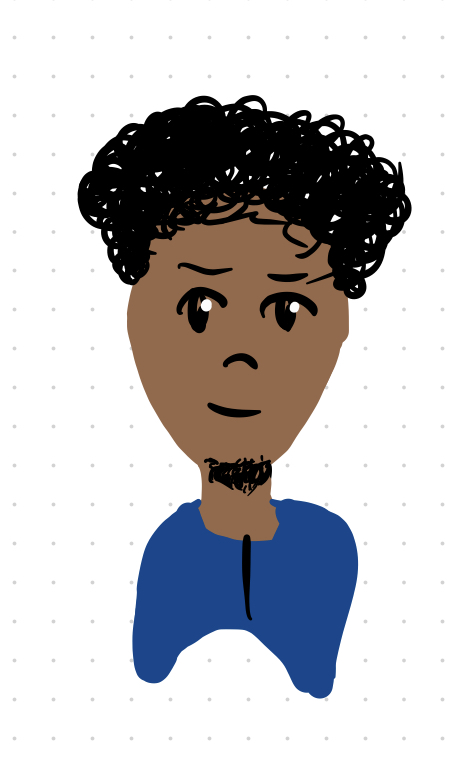
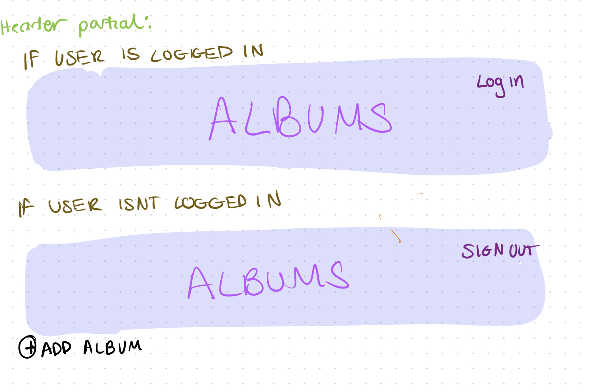
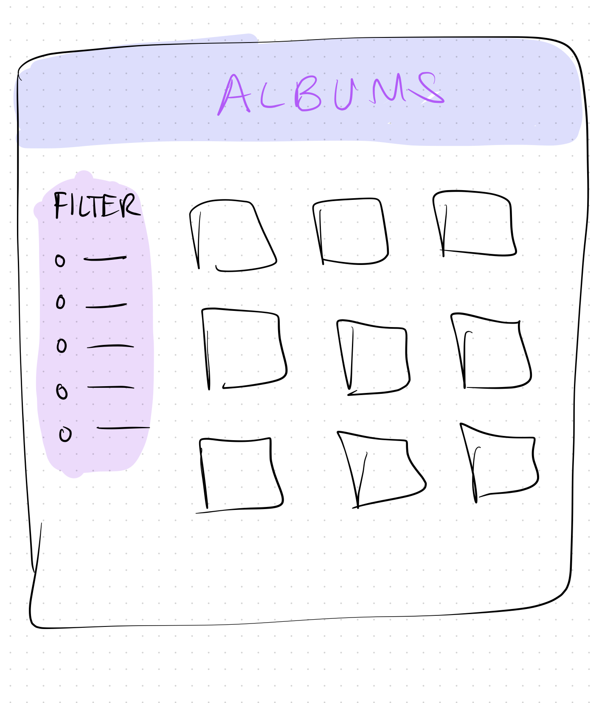

# Project 3: Design Journey

**For each milestone, complete only the sections that are labeled with that milestone.** Refine all sections before the final submission.

You are graded on your design process. If you later need to update your plan, **do not delete the original plan, rather leave it in place and append your new plan _below_ the original.** Then explain why you are changing your plan. Any time you update your plan, you're documenting your design process!

**Replace ALL _TODOs_ with your work.** (There should be no TODOs in the final submission.)

Be clear and concise in your writing. Bullets points are encouraged.

**Everything, including images, must be visible in _Markdown: Open Preview_.** If it's not visible in the Markdown preview, then we can't grade it. We also can't give you partial credit either. **Please make sure your design journey should is easy to read for the grader;** in Markdown preview the question _and_ answer should have a blank line between them.


## Design Plan (Milestone 1)

**Make the case for your decisions using concepts from class, as well as other design principles, theories, examples, and cases from outside of class (includes the design prerequisite for this course).**

You can use bullet points and lists, or full paragraphs, or a combo, whichever is appropriate. The writing should be solid draft quality.


### Catalog (Milestone 1)
> What will your catalog website be about? (1 sentence)

Music Albums and information on the album


### _Consumer_ Audience (Milestone 1)
> Briefly explain your site's _consumer_ audience. Your audience should be specific, but not arbitrarily specific. (1 sentence)
> Justify why this audience is a **cohesive** group. (1-2 sentences)

The audience contains young people who like to listen to music
This group is cohesive since yonger people are a focus rather than any group of people who likes to listen to music (everyone likes music). Younger people are targeted since they can be more engaged with technology and any new music/trends over a wider field of genres.


### _Consumer_ Audience Goals (Milestone 1)
> Document your _consumer_ audience's goals for using this catalog website.
> List each goal below. There is no specific number of goals required for this, but you need enough to do the job (Hint: It's more than 1. But probably not more than 3.)
> **Hint:** Users will be able to view all entries in the catalog and insert new entries into the catalog. The audience's goals should probably relate to these activities.

Goal 1: To understand their field of music better

- **Design Ideas and Choices** _How will you meet those goals in your design?_
  - The design of the catalog will have a filter to target a specfic field of music.
- **Rationale & Additional Notes** _Justify your decisions; additional notes._
- This is reasonable since it really helps the consumer map out what msuic they're looking for and narrow down their options for a better user experience.

Goal 2: To discover and learn more about other genres of music

- **Design Ideas and Choices** _How will you meet those goals in your design?_
  - Along with the filter feature, the catalog will have a page where different music albums are displayed neatly
- **Rationale & Additional Notes** _Justify your decisions; additional notes._
  - If the user isn't looking for a specific field of music, they have the choice to look at a pool of different music, and pick what stands out to them the most. This design can easily catch the user's eye.


### _Consumer_ Audience Device (Milestone 1)
> How will your _consumer_ audience access this website? From a narrow (phone) or wide (laptop) device?
> Justify your decision. (1 sentence)

Device: wide device
The wide space provided will allow me to properly lay out the music albums easier and give the consumer audience a more pleasing and aesthetic experience


### _Consumer_ Persona (Milestone 1)
> Use the goals you identified above to develop a persona of your site's _consumer_ audience.
> Your persona must have a name and a face. The face can be a photo of a face or a drawing, etc.

<html>


Anthony

**Factors that Influence Behavior:**

- Curious
- Organized
- Likes to listen to music for fun

**Goals:**

Wants to find music similar to his favorite genre

**Obstacles:**

Becomes influenced easily by others

**Desires:**

Wants to learn new things


### _Administrator_ Audience (Milestone 1)
> Briefly explain your site's _administrator_ audience. Your audience should be specific, but not arbitrarily specific. (1 sentence)
> Justify why this audience is a **cohesive** group. (1-2 sentences)

The audience contains people who are heavy music lovers.
This is a cohesive audience since these aren't typical music lovers, and these are people who are passionate about their music and wise about the information, willing to share it to others.


### _Administrator_ Audience Goals (Milestone 1)
> Document your _administrator_ audience's goals for using this catalog website.
> List each goal below. There is no specific number of goals required for this, but you need enough to do the job (Hint: It's more than 1. But probably not more than 3.)
> **Hint:** Users will be able to view all entries in the catalog and insert new entries into the catalog. The audience's goals should probably relate to these activities.

Goal 1: To learn more about music in their genre and others

- **Design Ideas and Choices** _How will you meet those goals in your design?_
  - The design will include filters to target specific tags that the user is looking for
- **Rationale & Additional Notes** _Justify your decisions; additional notes._
  - THe filter makes it easier for the users to find what their looking for.

Goal 2: To help other poeple learn about their preferred music (or theirs)

- **Design Ideas and Choices** _How will you meet those goals in your design?_
  - The design will include a form accessible for users to upload information about music they love or their own music.
- **Rationale & Additional Notes** _Justify your decisions; additional notes._
  - A form is a great way to add/edit a certain collection of things. It also guides the user well.


### _Administrator_ Persona (Milestone 1)
> Use the goals you identified above to develop a persona of your site's _administrator_ audience.
> Your persona must have a name and a face. The face can be a photo of a face or a drawing, etc.

<html>


Maya

**Factors that Influence Behavior:**

- Focused
- She paints as a hobby
- She also composes music (plays the piano)

**Goals:**

Wants to become a performer one day

**Obstacles:**

She is shy in public

**Desires:**

Wants to show people her music and show the importance of music overall


### Catalog Data (Milestone 1)
> Using your personas, identify the data you need to include in the catalog for your site's audiences.
> Justify why this data aligns with your persona's goals. (1 sentence)

- The catalog will have pictures of the albums as well as information about the music album. It will include a neat layout of all the albums along with a form that will be accessible for the users that would want to upload music.

This aligns with my persona's goals since it conducts a neat layout for the focused and serious people, presenting the thing that they love the most. The form will help any users upload any information to the site that they think will be useful for other people.


### Site Design (Milestone 1)
> Design your catalog website to address the goals of your personas.
> Sketch your site's design:
>
> - These are **design** sketches, not _planning_ sketches.
> - Use text in the sketches to help us understand your design.
> - Where the content of the text is unimportant, you may use squiggly lines for text.
> - **Do not label HTML elements or annotate CSS classes.** This is not a planning sketch.
>
> Provide a brief explanation _underneath_ each sketch. (1 sentence)
> **Refer to your persona by name in each explanation.**

<html>


This sketch represents the home pages for consumers like Anthony. The albums will be presented by album cover, with the log in feature at the very top of the page and the filter options on the top right. (These are the genres)

<html>


This catalog design consists of the same pattern but this is for the administrators with a "log out" option.

<html>


The details page goes into more context for each album, and allows the user to view album information. The cover is incuded again with the description/info to the side. The "delete album" is an option for the administrator to delete their entry.

<html>


The log in page is intended for the user to log in and administer (add/delete albums). It has a clear form with feedback for the user to log in to their account

<html>


This is my header partial along with the session schema and how the website will change whether the user is logged in or not. Users able to log in will be able to sign out and add an album of their choice.

**NEW HOME PAGE**
I made the following change to change the filter options from the top of the page to the side.

<html>



### Catalog Design Patterns (Milestone 1)
> Explain how you used design patterns in your site's design. (1-2 sentences)

In my design patters, I made sure to include a header and form basics to incorporate user interactivity.


## Implementation Plan (Milestone 1, Milestone 2, Milestone 3, Final Submission)

### Database Schema (Milestone 1)
> Plan the structure of your database. You may use words or a picture.
> A bulleted list is probably the simplest way to do this.
> Make sure you include constraints for each field.

<html>


**the field genre_id in the Albums table shouldn't be there

Albums

- id: Integer {NOT NULL, UNIQUE, PRIMARY KEY, AUTOINCREMENT},
- title: Text {NOT NULL}
- artist: Text {NOT NULL}
- num_songs: Integer {NOT NULL}
- reldate: Text {NOT NULL}
- descr: TEXT

Genres

- id: Integer {NOT NULL, UNIQUE, PRIMARY KEY, AUTOINCREMENT}
- genre_name: Text {NOT NULL}

Album_tages

- id: Integer {NOT NULL, UNIQUE, PRIMARY KEY, AUTO INCREMENT}
- album_id: INTEGER {NOT NULL, FOREIGN KEY}
- genre_id: INTEGER {NOT NULL, FOREIGN KEY}


### Database Query Plan (Milestone 1, Milestone 2, Milestone 3, Final Submission)
> Plan _all_ of your database queries.
> You may use natural language, pseudocode, or SQL.

```
Filter form on home page
For each genre in table:
  <radio button input>
  (echo out the genre name and assign it to its genre id)

if the form is submitted,
    make query#1:
    get the genre id that was submitted,
    join the albums table to album_tags,
    only where the genre id matches the id that was selected
If form isnt submitted,
    make query#2
    show all albums


Add album form:
If form is valid,
  show confirmation
  add values to the data base

  or each checkbox,
  if checkbox is checked,
  add id to database

  for image,
  create new path
else,
show sticky values and feedback


## Complete & Polished Website (Final Submission)

### Accessibility Audit (Final Submission)
> Tell us what issues you discovered during your accessibility audit.
> What do you do to improve the accessibility of your site?

I had a few contrast errors, and I learned that I needed labels for my radio buttons. From this feedback, I made sure that my words were visible enough.

### Self-Reflection (Final Submission)
> Reflect on what you learned during this assignment. How have you improved from Projects 1 and 2?

I learned a lot. Different from the first two projects, I learned how to closely analyze my information and apply it to what I'm trying to do. I learned how to use break points more and the debugger to try and solve any issues. I would say this project was a big step from what we've been learning, so it was very different for me. I'm usually used to the slow paced milestones, starting from 1300, but I was aware it was gonna be different from 1300. The way sessions work and the http_build_query function works is still in my understanding, and I still have a long way to fully become comfortable with it.


> Take some time here to reflect on how much you've learned since you started this class. It's often easy to ignore our own progress. Take a moment and think about your accomplishments in this class. Hopefully you'll recognize that you've accomplished a lot and that you should be very proud of those accomplishments! (1-3 sentences)

I am proud. I'm proud that I can answer a question about one of my projects and explain what a certain line of code means, or if someone needed help with the last two projects.


### Collaborators (Final Submission)
> List any persons you collaborated with on this project.

N/A


### Reference Resources (Final Submission)
> Please cite any external resources you referenced in the creation of your project.
> (i.e. W3Schools, StackOverflow, Mozilla, etc.)

https://developer.mozilla.org/en-US/
https://www.wikipedia.org/
https://www.w3schools.com/


### Grading: User Accounts (Final Submission)
> The graders will need to log in to your website.
> Please provide the usernames and passwords.

**Administrator User:**

- Username: valerie
- Password: monkey

**Doesn't support consumer log in**


### Grading: Step-by-Step Instructions (Final Submission)
> Write step-by-step instructions for the graders.
> The project if very hard to grade if we don't understand how your site works.
> For example, you must log in before you can delete.
> For each set of instructions, assume the grader is starting from /

_View all entries:_

Open home page. No log in is required

_View all entries for a tag:_

1. Select a genre on the form on the home page
2. Click filter

_View a single entry's details:_

1. Click any album

_How to insert and upload a new entry:_

1. On the home page, press log in.
2. Enter username and password
3. Fill out form and press submit
4. The confirmation message will provide a link back to the home page.

_How to delete an entry:_

**not supported**
